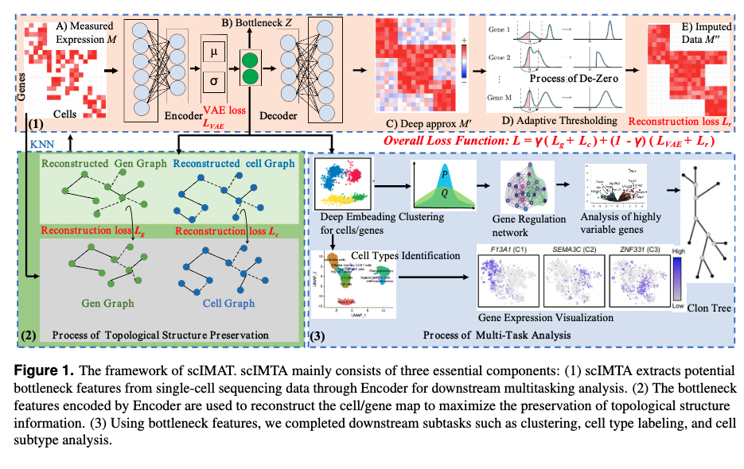

# scIMTA
`scIMTA` is a Python package containing tools for clustering single-cell data based on a graph-embedding autoencoder that simultaneously learns cell–cell topology representation and cluster assignments.

- [Overview](#overview)
- [System Requirements](#system-requirements)
- [Installation Guide](#installation-guide)
- [Usage](#Usage)
- [Data Availability](#data-availability)
- [License](#license)


# Overview
The advent of single-cell transcriptome sequencing (scRNA-seq) has revolutionized our ability to analyze gene expression at the individual cell level, overcoming the limitations of bulk RNA sequencing. However, the explosive growth of scRNA-seq data and the prevalence of dropout events pose significant challenges for downstream analysis. Existing methodologies often focus on isolated tasks, such as identifying cell communities, processing dropout events, mitigating batch effects, neglecting collaborative multi-task analysis, and introducing new noise during dropout event handling. In response to these challenges, we propose scIMTA (Interpretable Multi-Task Analysis of Single-Cell), an advanced framework designed to enhance interpretability and effectively address the issues of topological structure preservation and dropout events. The key innovations of scIMTA are as follows.(1) Collaborative Multi-Task Analysis: scIMTA facilitates collaborative analysis by simultaneously handling tasks such as processing sparse, high-noise gene expression data, reconstructing cell and gene graphs, and detecting cell and gene communities through deep clustering. (2) Interpretability with Biological Significance: scIMTA enhances interpretability by connecting the outcomes of candidate tasks with insights gleaned from domain studies. For example, it clarifies cell clustering by highly variable genes within gene communities, thus offering results grounded in biological significance. (3) Robust Dropout Handling: scIMTA focuses on accurately addressing false and true biological zeros in real datasets through a low-rank approximation and topological structures preservation, thereby mitigating the introduction of noise during dropout event handling. (4) Validation on Extensive Real Dataset: Our scIMTA framework has undergone rigorous validation using breast cancer scRNA-seq data we collected and acquired comparable performance, emphasizing its efficacy and generalizability. Notably, experimental results affirm the superiority of scIMTA over prominent scRNA-seq baselines, including scGAE, scTAG, and scDCC. The proposed framework comprehensively addresses challenges inherent in scRNA-seq data. It establishes a new framework for collaborative multi-task analysis, interpretability, and robust dropout handling in single-cell transcriptome studies. This work significantly advances the field and allows a more nuanced exploration of cellular heterogeneity and gene expression dynamics.




# System Requirements
## Hardware requirements
`scIMTA` package requires only a standard computer with enough RAM to support the in-memory operations.

## Software requirements
### OS Requirements
This package is supported for *Linux*. The package has been tested on the following systems:
+ Linux: Ubuntu 18.04

### Python Dependencies
`scIMTA` mainly depends on the Python scientific stack.
```
numpy
scipy
tensorflow
scikit-learn
pandas
scanpy
anndata
```
For specific setting, please see <a href="https://github.com/Philyzh8/scIMTA/blob/master/requirements.txt">requirement</a>.

# Installation Guide:

### Install from PyPi

```
$ conda create -n scIMTA_env python=3.6.8
$ conda activate scIMTA_env
$ pip install -r requirements.txt
$ pip install scIMTA
```

# Usage
`scIMTA` is a deep graph embedding learning method for single-cell clustering, which can be used to:
+ Single-cell data clustering. The example can be seen in the <a href="https://github.com/Philyzh8/scIMTA/blob/master/tutorial/demo.py">demo.py</a>.
+ Correct the batch effect of data from different scRNA-seq protocols. The example can be seen in the <a href="https://github.com/Philyzh8/scIMTA/blob/master/tutorial/demo_batch.py">demo_batch.py</a>.
+ Analysis of the mouse brain data with 1.3 million cells. The example can be seen in the <a href="https://github.com/Philyzh8/scIMTA/blob/master/tutorial/demo_scale.py">demo_scale.py</a>.
+ Provide an automatic hyperparameter search algorithm. The example can be seen in the <a href="https://github.com/Philyzh8/scIMTA/blob/master/tutorial/demo_para.py">demo_para.py</a>.

We give users some suggestions for running in the <a href="https://github.com/Philyzh8/scIMTA/blob/master/tutorial/tutorial.md">tutorial.md</a>.


# Data Availability

The real data sets we used can be download in https://pan.baidu.com/s/1oRdGQR58KEklzz6qXZXHug?pwd=8yjy code: 8yjy 


